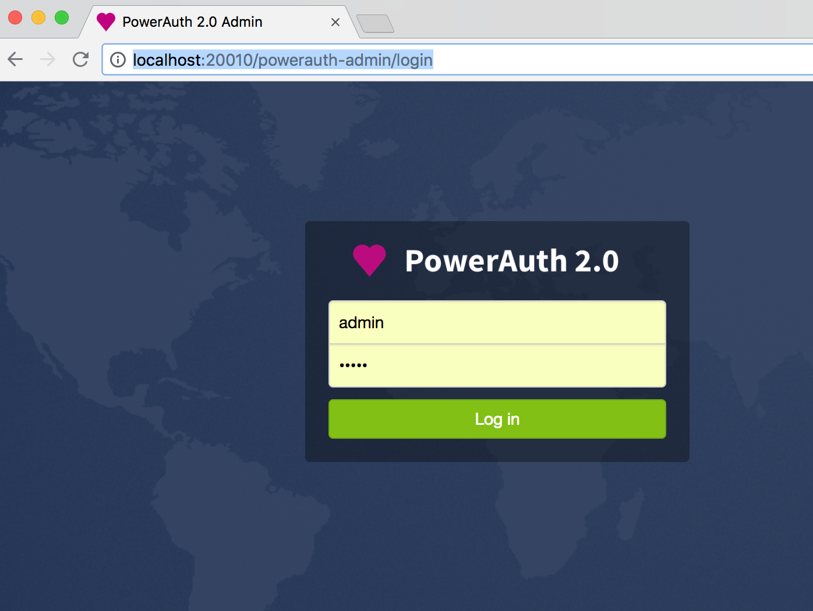
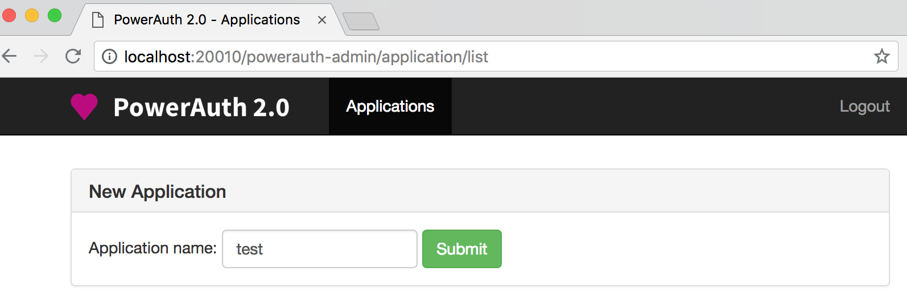
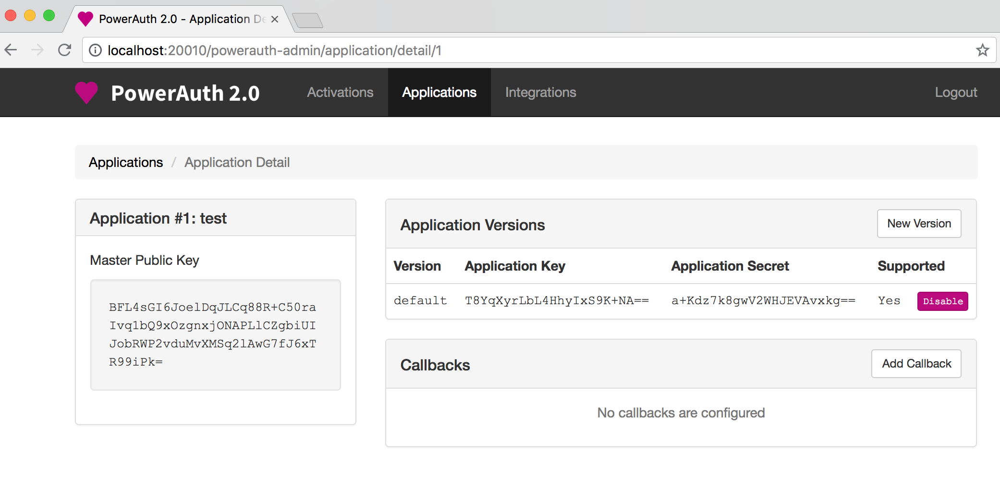

# Basic Testing

You can test whether the deployment of basic Docker images was correct.

Follow these steps:

1. Follow the [Getting Started instructions](./Getting-Started.md)

2. Access URL: [http://localhost:20010/powerauth-admin/login](http://localhost:20010/powerauth-admin/login)

3. Login with username: `admin`, password: `admin`:

4. Create a new application, specify a name, e.g. `test`:

The application is created with generated master public key, application key and application secret:

