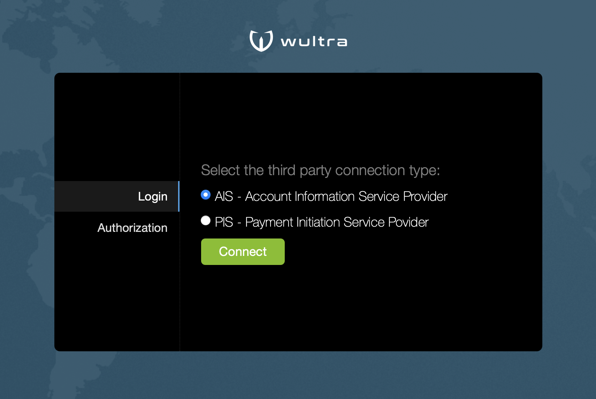

# Web Flow Testing

You can use our basic "testing kit" to test if the building and deployment of complete PowerAuth stack Docker images was correct.

Follow these steps:

1. Follow the instructions in section [Getting-Started](./Getting-Started.md) and start Docker containers for whole PowerAuth stack including Web Flow (using Docker Compose file `docker-compose-pa-all.yml`).
2. Download and unpack `powerauth-webflow-testing.zip` file from the [release](https://github.com/wultra/powerauth-docker/releases) section.
3. If needed, modify properties in `application.properties` file.
4. Start the application by `sh start.sh` command.
5. Open [http://localhost:8888](http://localhost:8888) in browser.

You should see a demo app that has three features:

- Payment authorization demo.
- Operation authorization demo (by operation ID).
- Login demo (simple OAuth 2.0 dance).

It looks like this:

In the default configuration, with mock `powerauth-data-adapter.war` image, you can use user with any username (for example, `demo`), with static password `test`.

For payments and operations that require 2FA, there is an SMS OTP enabled by default. SMS code is stored in the database. By default, you can connect to it using following credentials:

| parameter | value |
|---|---|
| URL | `jdbc:mysql://localhost:23376/powerauth` |
| username | `root` |
| password | `root` |
| table name | `da_sms_authorization` |

You need to order records by `timestamp_created` column to see only the latest SMS OTP codes. The SMS OTP code is stored in column `authorization_code`.
